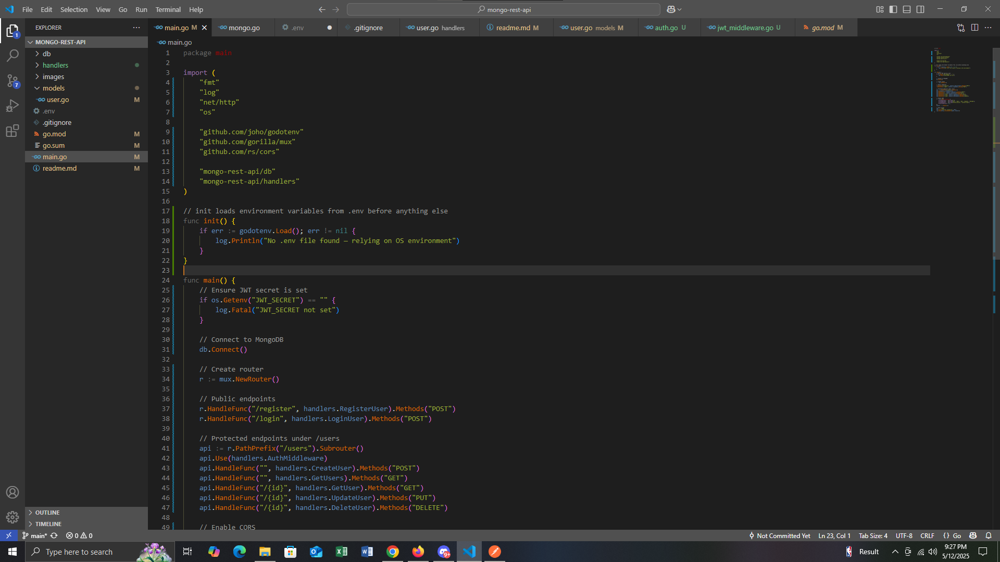
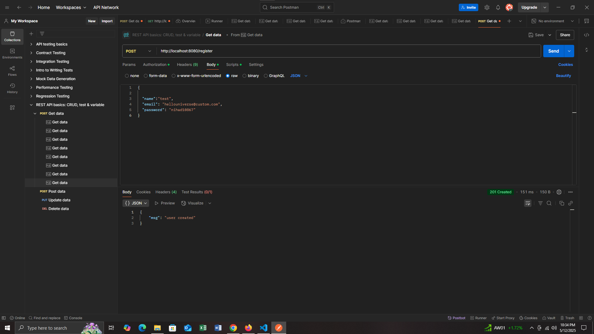
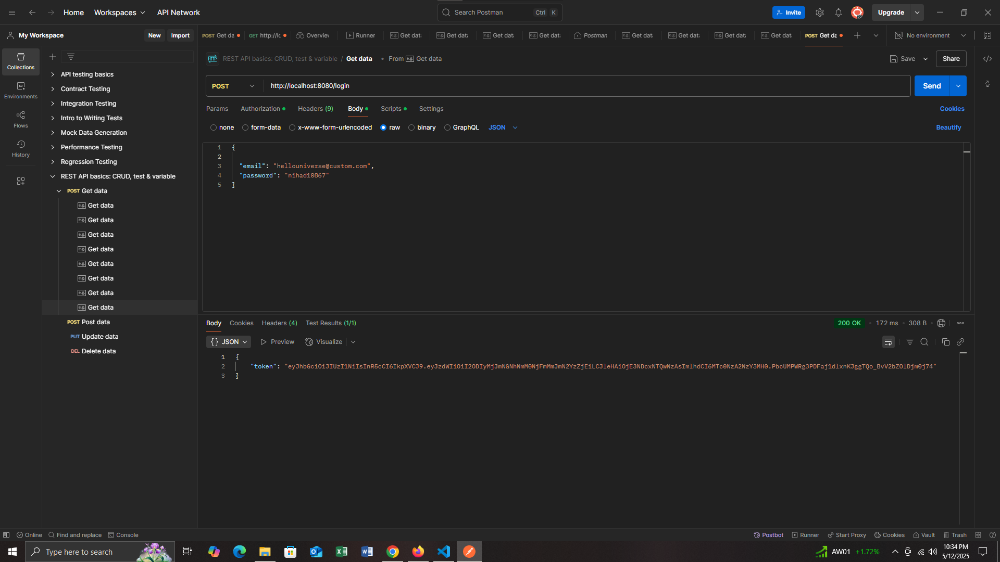
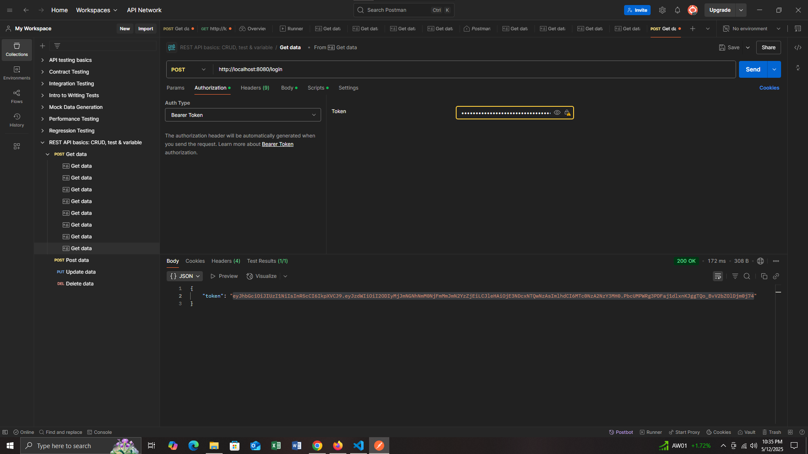
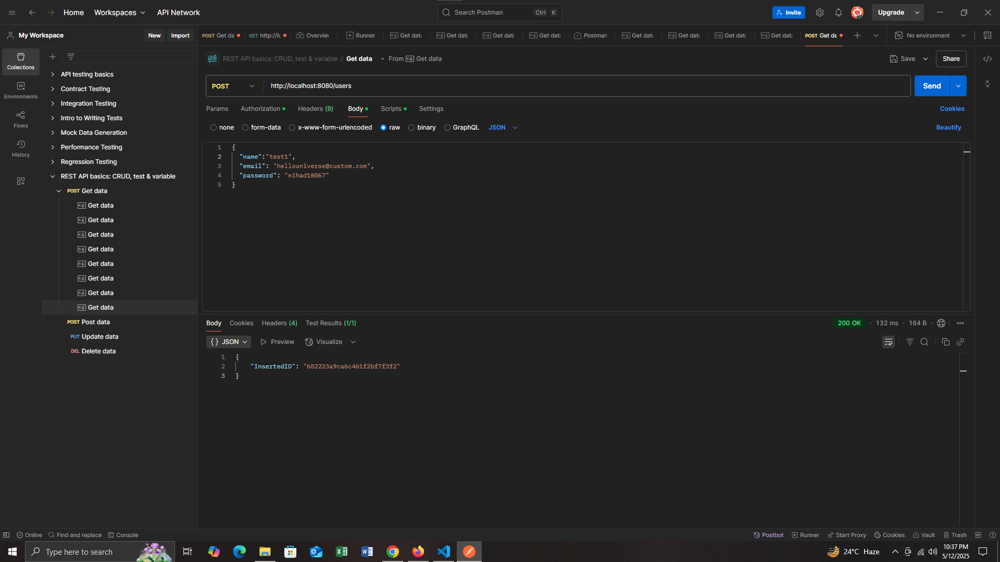
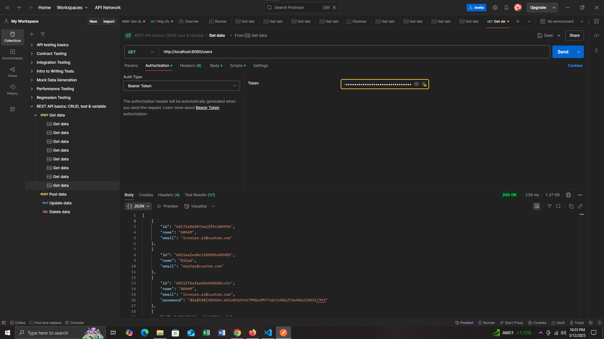
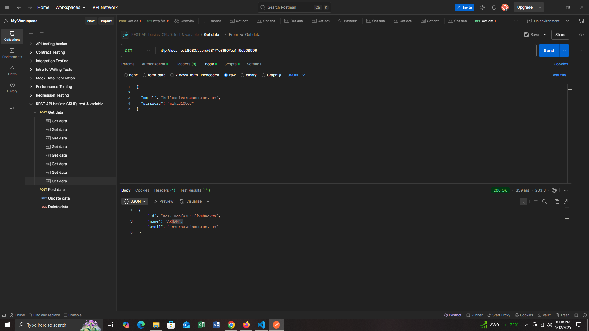
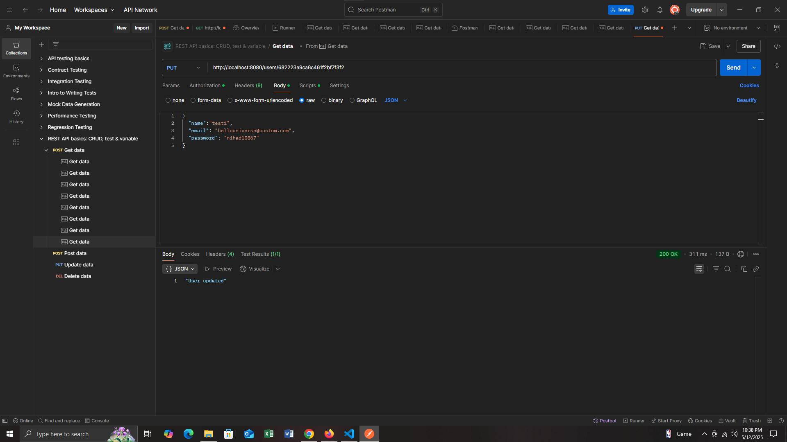
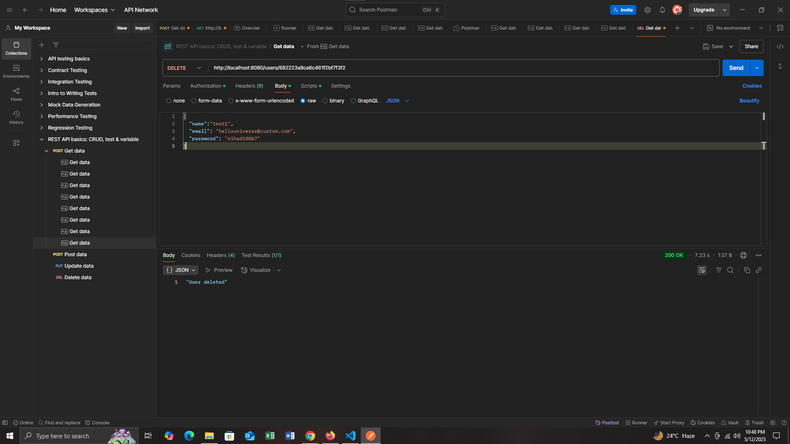

# Mongo REST API in Go

## 📌 Purpose
This project is a RESTful API built with Go that provides user authentication and CRUD operations using MongoDB. It includes secure authentication using JWT, proper CORS handling, and is tested using Postman. The goal is to demonstrate how to build a scalable and secure REST API using Go and MongoDB.

---

## 🛠️ Technologies Used
- **Go (Golang)** – Main programming language
- **MongoDB** – Database for storing user data
- **JWT (JSON Web Tokens)** – For user authentication and session management
- **CORS** – To handle cross-origin resource sharing securely
- **Postman** – For testing API endpoints

---

## 📁 Project Structure

```

mongo-rest-api/
├── main.go                   # Entry point of the application
├── db/
│   └── mongo.go              # MongoDB connection setup
├── models/
│   └── user.go               # User model definition
├── handlers/
│   ├── user.go               # Handlers for user CRUD operations
│   ├── auth.go               # Registration and login logic
│   └── jwt_middleware.go     # JWT validation middleware
├── .env                      # Environment variables (e.g., DB URI, JWT secret)
├── .gitignore                # Files and directories to ignore in Git
└── readme.md                 # This documentation file

````

---

## 🧪 API Testing with Postman

### 🔸 Initial Codebase

A screenshot of the initial project structure.



---

### 🔸 Register a New User

**Endpoint**: `POST /register`  
**Payload**:
```json
{
  "name": "Mazhar",
  "email": "mazhar@example.com",
  "password": "123456"
}
````

**Postman Screenshot:**



---

### 🔸 Login to Get JWT Token

**Endpoint**: `POST /login`
**Payload**:

```json
{
  "email": "mazhar@example.com",
  "password": "123456"
}
```

**Response**: Returns a JWT token

**Postman Screenshot:**



---

### 🔸 Token Setup in Postman

Once you get the token from `/login`, set it in Postman:

* Go to the **Authorization** tab
* Choose **Bearer Token**
* Paste the JWT token

**Postman Screenshot:**



---

## 🔄 CRUD Operations with JWT Token

All endpoints below require the JWT token in the Authorization header.

---

### 🔹 Create User (POST /users)

**Payload**:

```json
{
  "name": "John Doe",
  "email": "john@example.com"
}
```

**Postman Screenshot:**



---

### 🔹 Get All Users (GET /users)

**Postman Screenshot:**



---

### 🔹 Get User by ID (GET /users/{id})

Replace `{id}` with a valid MongoDB user ID.

**Postman Screenshot:**



---

### 🔹 Update User (PUT /users/{id})

**Payload**:

```json
{
  "name": "Updated Name",
  "email": "updated@example.com"
}
```

**Postman Screenshot:**



---

### 🔹 Delete User (DELETE /users/{id})

**Postman Screenshot:**



---

## ✅ Environment Variables Example (`.env`)

```env
MONGO_URI=mongodb://localhost:27017
JWT_SECRET=your_jwt_secret_key
PORT=8080
```

---

## 🚀 How to Run

1. **Clone the repository**:

   ```bash
   git clone https://github.com/yourusername/mongo-rest-api.git
   cd mongo-rest-api
   ```

2. **Set up `.env`** with your environment values (DB URI, JWT secret, port).

3. **Install dependencies and run**:

   ```bash
   go run main.go
   ```

---


